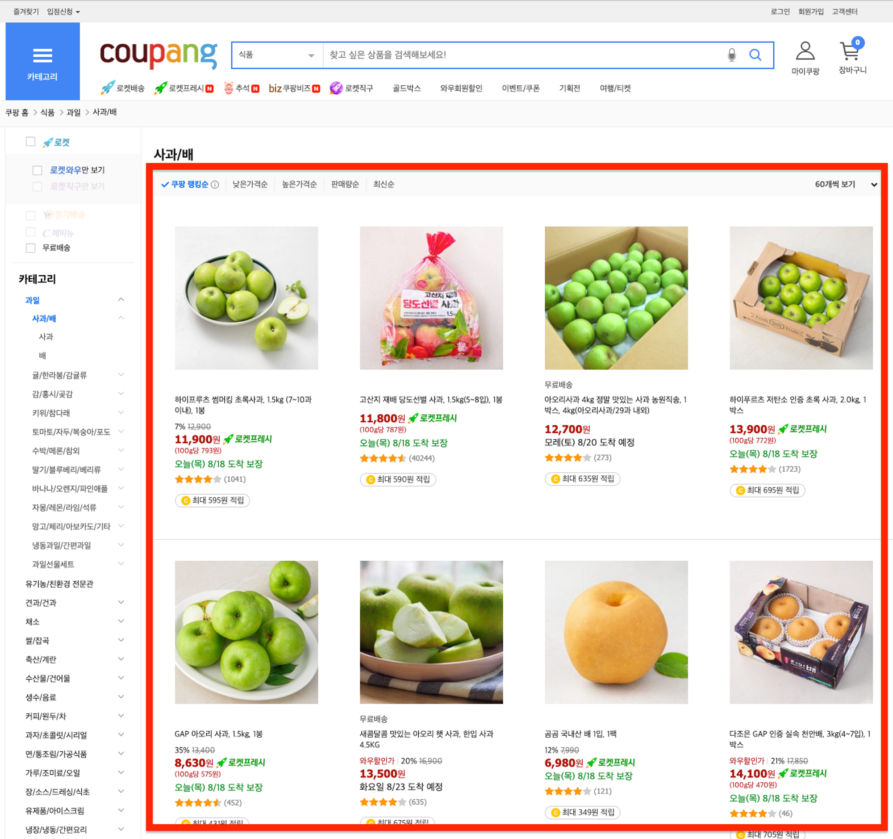

## NUMBLE - 가장 실무에 가까운 쿠팡 클론코딩 4회차

- [배포 URL](https://coupang-clone-stage4.netlify.app/products?offset=0&limit=12&sorter=bestAsc)

<details>
  <summary style='font-size:20px'>과제보기</summary>

  <div markdown="1">

  <br/>

## API 소개

- 이번 챌린지에서 우리는 상품 리스트 API를 사용할거에요.

- offset,limit 페이지네이션을 지원하며, sorter 파라미터를 통해 데이터를 정렬할 수 있어요.

- sorter 쿼리 파라미터에는 다음 값들이 들어갈 수 있어요.

  - bestAsc: ‘쿠팡 랭킹순'에 사용돼요.

  - salePriceAsc: ‘낮은가격순'에 사용돼요.

  - salePriceDesc: ‘높은가격순'에 사용돼요.

  - saleCountDesc: ‘판매량순'에 사용돼요.

  - latestAsc: ‘최신순'에 사용돼요.

---

## 구현



- 이번 챌린지에서는 위 스크린샷에서 붉게 표시된 영역을 구현해볼거에요.

- 나머지 영역은 이번 미션의 주제와 무관하거나 동일한 방식으로 대응할 수 있기 때문에 구현하지 않아요!

- 아래 주의사항을 참고하며 구현해보아요.

- 정렬/페이지크기를 변경이 URL에 반영되어야합니다.

- initial render시에 정렬/페이지크기가 변경된 상태의 URL을 읽어 적절히 반영해야합니다.

- 페이지크기는 ‘12개씩 보기', ‘24개씩 보기' 두 가지를 선택할 수 있게끔 구현해주세요.

- 상품 리스트의 데이터 비동기 처리에 React Suspense를 이용해보아요.

- 아래 패키지를 사용해 나만의 fallback 컴포넌트를 구현해보아요!

  - [React Spinners](https://www.davidhu.io/react-spinners/)

    </div>
  </details>

---

## Suspense

- 상품 목록을 보여주는 ProductList 컴포넌트 같은 경우 Suspense를 적용하기 위해서 next.js의 [`Dynamic import`](https://nextjs.org/docs/advanced-features/dynamic-import)를 사용했습니다.

- 그리고 Client Side에서 컴포넌트를 불러오기 때문에 `ssr:false` 옵션을 설정해 주었습니다.

```jsx
// pages/products.tsx

...

const ProductList = dynamic(() => import('../src/components/ProductList'), {
  ssr: false,
});

export default function ProductListPage() {
  const route = useRouter();

  const { offset = '0', limit = '12', sorter = 'bestAsc' } = route.query;

  return (
    <Wrapper>
      <ProductMenu offset={offset} limit={limit} sorter={sorter} />
      <Suspense fallback={<Spinner />}>
        <ProductList offset={offset} limit={limit} sorter={sorter} />
      </Suspense>
      <ProductPagination offset={offset} limit={limit} sorter={sorter} />
    </Wrapper>
  );
}

```

---

<br/>

## Pagination

- router 관련 기능들이 각 컴포넌트들에 있다면 분포되어있어서 결합도가 높다는 단점이 생깁니다.

- 따라서 페이지 이동을 위한 router 관련 코드들을 모아서 응집도를 높이고 결합도를 낮추기 위해서 page 이동을 위한 Custom hook을 정의해주었습니다

```jsx
// hooks/usePageRoute

import { useRouter } from 'next/router';
import { queryType } from '../types/product.types';

const usePageRoute = () => {
  const router = useRouter();

  const updatePage = ({ offset, limit, sorter }: queryType) => {
    router.push(`/products?offset=${offset}&limit=${limit}&sorter=${sorter}`);
  };

  return {
    updatePage,
  };
};

export default usePageRoute;
```

<br/>

- 이렇게 정의한 Custom hook을 page를 이동해서 URL을 변경해야 하는 컴포넌트에서 사용했습니다.

```jsx
// components/ProductPagination

...

const ProductPagination = ({ offset, limit, sorter }: queryType) => {
  const { updatePage } = usePageRoute();

  const handleChangeOffset = (pagination: number) => {
    const offset = `${pagination === 1 ? 0 : (pagination - 1) * Number(limit)}`;
    updatePage({ offset, limit, sorter });
  };

  const getCurrentPage = () => {
    if (Number(limit) === SHOW_TWENTY_FOUR) {
      return Number(offset) === 0 ? 1 : 2;
    } else {
      return Number(offset) === 0 ? 1 : Number(offset) / Number(limit) + 1;
    }
  };

  return (
    <Pagination
      current={getCurrentPage()}
      pageSize={Number(limit)}
      total={DEFAULT_TOTAL}
      showSizeChanger={false}
      onChange={(pagination) => handleChangeOffset(pagination)}
    />
  );
};

export default ProductPagination;
```
