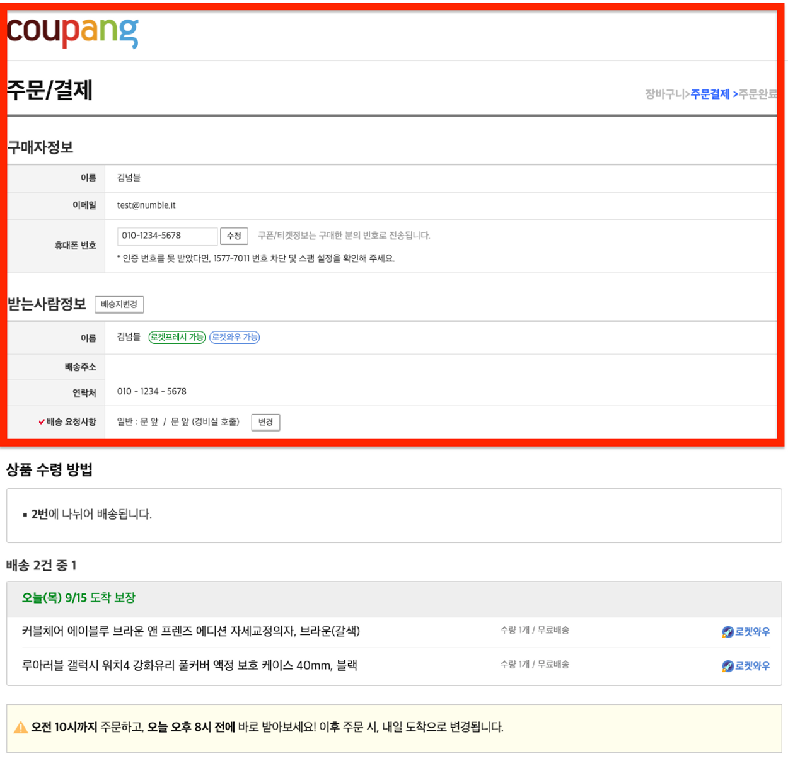
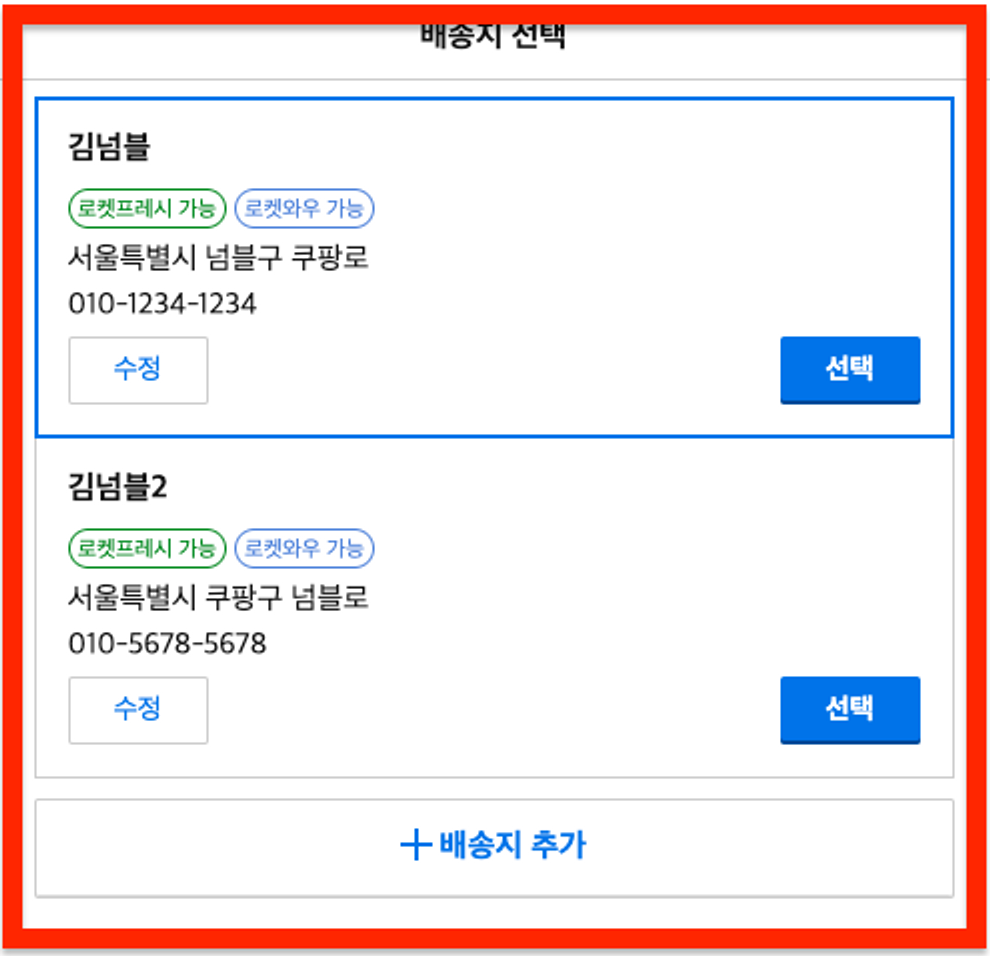
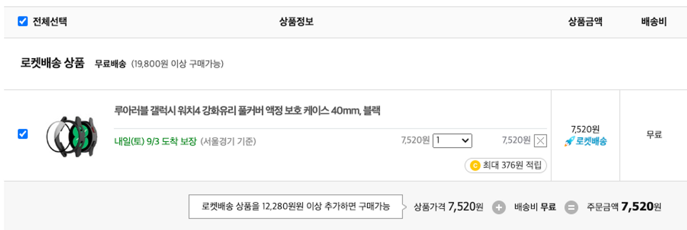
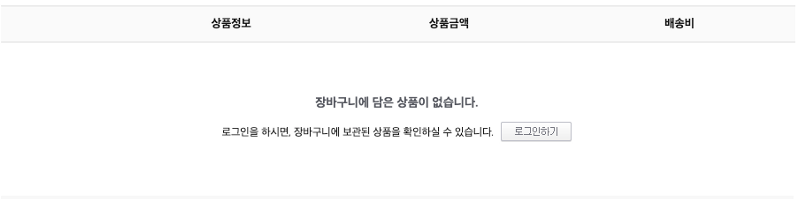

## 배포

[배포 URL](https://coupang-clone-2-stage5.netlify.app/cart)

<br/>

## 구현 과제

- 이번 챌린지에서는 [쿠팡 장바구니 페이지](https://cart.coupang.com/cartView.pang)를 구현해보겠습니다



- 이번 챌린지에서는 위 스크린샷에서 붉게 표시된 영역을 구현해볼거에요.

- ‘품절/판매종료상품 전체삭제', ‘묶음배송 추가' 기능은 무시해주세요

<br/>



- 수량 변경 UI는 쿠팡의 selector대신 위 스크린샷처럼 구현해주세요

<br/>

- 아래는 다양한 상황에서의 UI 예시입니다.

- 로켓배송 무료배송 기준이 충족되지 않은 상황 예시입니다.



<br/>

- 장바구니가 비어있는 상황 예시입니다.



- 아래 주의사항을 참고하며 구현해보아요.

  - 로켓배송의 무료배송 기준금액은 19,800원이에요

  - 모든 로켓배송 상품은 함께 배송된다고 생각해주세요

  - 모든 판매자배송 상품은 따로 배송된다고 생각해주세요

  - 상품 수량 변경 기능을 단순히 구현하면 1초동안 상품 수량 증가 버튼을 10번 누른 경우, 서버에 10번 요청을 보내야할 수도 있습니다! 요청이 덜 발생하도록 최적화해보아요.

  - 상품 수량 변경, 삭제 API는 50% 확률로 실패하도록 해두었습니다. 에러 상황을 적절히 대응해보아요

---

### API 목록

1. 카트 조회

   - 경로: /api/cart

   - 보유한 cart-item 목록을 반환합니다.

   - HTTP METHOD: GET

   - Bearer Token 필요

2. 카트 초기화

   - 경로: /api/cart/reset

   - 보유한 cart-item을 모두 삭제하고, 임의로 5개를 생성합니다. (개발 편의를 위해 제공됩니다)

   - HTTP METHOD: POST

   - Bearer Token 필요

3. 카트아이템 업데이트

   - 수량 변경 시 이 API를 사용해주시면 됩니다.

   - 경로: /api/cart-items/[cartItemId]

   - HTTP METHOD: PATCH

   - Bearer Token 필요

   - Request body (example)

     ```json
     {
       "quantity": 3
     }
     ```

4. 카트아이템 삭제

   입력된 ID의 카트아이템을 삭제합니다.

   - 경로: /api/cart-items/[cartItemId]

   - HTTP METHOD: DELETE

   - Bearer Token 필요

<br/>

## 구현 결과

- 초기화 버튼을 누르면 새롭게 데이터를 불러올 수 있습니다.

### useCartItems

- 서버에서 카트 아이템을 받아온 다음 관리하기 위한 useCartItems hook을 정의해주었습니다.

```ts

...

// hooks/useCartItems.ts

const useCartItems = (data: cartItemType[]) => {
  const [checkAll, setCheckAll] = useState(false); // 전체선택 체크 여부
  const [checkedItems, setCheckedItems] = useState<string[]>([]); // 전체 상품 중 체크된 항목의 id 값
  const [rocketItems, setRocketItems] = useState<cartItemType[]>([]); // 로켓배송 상품
  const [sellerItems, setSellerItems] = useState<cartItemType[]>([]); // 판매자배송 상품
  const [items, setItems] = useState<cartItemType[]>([]); // 전체 카트 아이템

  const handleCheckAll = (e: React.ChangeEvent<HTMLInputElement>) => {
    const target = e.target as HTMLInputElement;

    if (target.checked) {
      setCheckAll(target.checked);

      const checkAllItems = items?.map((item) => `${item.id}`);
      setCheckedItems(checkAllItems);
    } else {
      setCheckAll(target.checked);

      setCheckedItems([]);
    }
  };

  const handleCheck = (e: React.ChangeEvent<HTMLInputElement>) => {
    const target = e.target as HTMLInputElement;

    if (checkedItems.includes(target.id)) {
      const filteredItems = checkedItems.filter((id) => id !== target.id);
      setCheckedItems(filteredItems);

      if (checkAll) {
        setCheckAll(false);
      }
    } else {
      const newItems = [...checkedItems, target.id];
      setCheckedItems(newItems);

      if (newItems.length === items.length) {
        setCheckAll(true);
      }
    }
  };

...

  useEffect(() => {
    if (!data) return;

    setItems(data);

    const rocketItems = filterItemsByType(data, ROCKET_ITEM);
    setRocketItems(rocketItems);
    const sellerItems = filterItemsByType(data, SELLER_ITEM);
    setSellerItems(sellerItems);
  }, [data]);

  return {
    rocketItems,
    sellerItems,
    handleCheckAll,
    handleCheck,
    checkAll,
    checkedItems,
    resetCheckedState,
  };
};

export default useCartItems;
```

- 우선 서버에서 카트 아이템을 받아오면 useState을 사용해서 카트 이이템을 관리할 수 있도록 했습니다.

- 그리고 구현해야 하는 항목이 로켓배송 상품, 판매자 상품으로 나누어져 있고 각 항목에 따라 주문 금액을 계산해 주어야 했기 때문에 로켓배송 상품과 판매자 상품을 관리하기 위한 usestate을 정의하고 해당 값들을 저장해주었습니다.

-

```ts
useEffect(() => {
  if (!data) return;

  setItems(data); // 전체 카트 아이템

  // 로켓배송 상품
  const rocketItems = filterItemsByType(data, ROCKET_ITEM);
  setRocketItems(rocketItems);

  // 판매자 상품
  const sellerItems = filterItemsByType(data, SELLER_ITEM);
  setSellerItems(sellerItems);
}, [data]);
```

- 각각의 상품들을 체크할 수 있고 전체 선택 체크박스를 클릭해서 전체 상품을 한번에 체크하거나 취소할 수 있기 때문에 각 항목을 체크할 수 있는 함수를 정의해주었습니다.

```ts
// 전체선택 체크 박스 클릭 했을 때 실행되는 함수

const handleCheckAll = (e: React.ChangeEvent<HTMLInputElement>) => {
  const target = e.target as HTMLInputElement;

  // 전체선택 체크했을 때
  if (target.checked) {
    setCheckAll(target.checked);

    // 모든 카트 아이템을 선택해준다.
    const checkAllItems = items?.map((item) => `${item.id}`);
    setCheckedItems(checkAllItems);
  } else {
    // 전체선택 체크 취소했을 때
    setCheckAll(target.checked);

    // 기존에 체크되어 있던 항목들 모두 취소해준다.
    setCheckedItems([]);
  }
};

// 각각의 항목 체크박스 클릭했을 때 실행되는 함수
const handleCheck = (e: React.ChangeEvent<HTMLInputElement>) => {
  const target = e.target as HTMLInputElement;

  // 체크박스 클릭한 항목이 이미 체크되어 있는 경우
  if (checkedItems.includes(target.id)) {
    // 해당 항목을 제외한다.
    const filteredItems = checkedItems.filter((id) => id !== target.id);
    setCheckedItems(filteredItems);

    // 전체 선택 체크되어 있는 경우에는 취소해준다.
    if (checkAll) {
      setCheckAll(false);
    }
  } else {
    // 새롭게 체크한 항목 추가
    const newItems = [...checkedItems, target.id];
    setCheckedItems(newItems);

    // 새롭게 id가 추가 되었을 때 체크 id를 관리하는 배열의 개수가 전체 카트 아이템 개수와 같은 경우, 모든 카트 아이템이 선택된 상태이기 때문에 전체 선택도 체크해준다.
    if (newItems.length === items.length) {
      setCheckAll(true);
    }
  }
};
```

- 이렇게 체크 상태가 변경될 때마다 변경된 `checkedItems`값을 필요한 컴포넌트에 전달해서 체크 상태 UI를 변경해주고 체크된 상품의 주문금액을 계산해주었습니다.

```tsx
// components/CartItems.tsx

...

// 로켓배송 상품
{
  rocketItems.length > 0 && (
    <>
      {rocketItems.map((item: cartItemType) => (
        <CartItem
          key={item.id}
          item={item}
          handleCheck={handleCheck}
          checked={checkedItems.includes(`${item.id}`)} // 해당 id가 체크되었는지 여부를 true, false로 전달
        ></CartItem>
      ))}
      <CartItemOrderAmount
        type={ROCKET_ITEM}
        items={rocketItems}
        checkedItems={checkedItems} // 체checkedItems 전달해서 체크된 항목의 상품 주문 금액 계산한다.
      ></CartItemOrderAmount>
    </>
  );
}
```

<br/>

### quries/cart.ts

- 쿼리를 관리하기 위한 `quries`라는 폴더를 만들고 `cart.ts` 파일을 만들어서 카트와 관련된 쿼리를 관리해주었습니다.

- 카트 아이템의 수걍을 변경하고 삭제할 수 있었기 때문에 그럴 때 마다 `queryClient.setQueryData`를 사용해서 cache 된 데이터를 변경해주었습니다.

```ts

// quries/cart.ts

...

// 카트 아이템을 가져온다.
export const useGetCartItems = () => {
  return useRequest([`cart-items`], () => CartService.getCartItem());
};


// 카트 아이템 수량 변경
export const useUpdateCartItem = (cartItemId: number) => {
  const queryClient = useQueryClient();

  return useMutate<boolean, number>(
    (quantity: number) => CartService.updateCartItem(cartItemId, quantity),

    {
      onSuccess: (_data, quantity: number) => {

        // 성공하는 경우, queryClient.setQueryData을 사용해서 선택한 항목의 수량을 변경해준다.
        queryClient.setQueryData(
          [`cart-items`],
          (prevData: cartItemType[] | undefined): cartItemType[] => {
            if (!prevData) return [];
            const newItems = prevData.map((item) =>
              item.id === cartItemId ? { ...item, quantity } : item
            );
            return newItems;
          }
        );
      },

      onError: () =>
        alert(
          '선택한 상품의 수량을 변경하는데 실패했습니다. 다시 시도해주세요.'
        ),
    }
  );
};


// 카트 아이템 삭제
export const useDeleteCartItem = (cartItemId: number) => {
  const queryClient = useQueryClient();

  return useMutate<boolean>(() => CartService.deleteCartItem(cartItemId), {

    // 성공하는 경우, queryClient.setQueryData을 사용해서 선택한 항목을 삭제해준다.
    onSuccess: () => {
      queryClient.setQueryData(
        [`cart-items`],
        (prevData: cartItemType[] | undefined): cartItemType[] => {
          if (!prevData) return [];
          const newItems = prevData?.filter((item) => item.id != cartItemId);

          return newItems;
        }
      );
    },
    onError: () =>
      alert('선택한 상품을 삭제하는데 실패했습니다. 다시 시도해주세요.'),
  });
};

```

- 이전에 useCartItems hook에서 정의해준 useEffect의 dependency를 cache된 data로 정해주었기 때문에 수량 변경 또는 삭제를 통해 cache된 데이터가 변경될 때 마다 useEffect가 실행되어 변경된 카트 아이템에 맞게 로켓배송 상품과 판매자 상품을 보여주게 됩니다.

```ts
// hooks/useCartItems.ts

useEffect(() => {
  if (!data) return;

  setItems(data);

  const rocketItems = filterItemsByType(data, ROCKET_ITEM);
  setRocketItems(rocketItems);
  const sellerItems = filterItemsByType(data, SELLER_ITEM);
  setSellerItems(sellerItems);
}, [data]);
```

<br/>

---

### Debounce

- 구현 사항 중에 `상품 수량 변경 기능을 단순히 구현하면 1초동안 상품 수량 증가 버튼을 10번 누른 경우, 서버에 10번 요청을 보내야할 수도 있습니다! 요청이 덜 발생하도록 최적화해보아요.`라는 항목이 있습니다.

- 이러한 문제를 방지하기 위해 debounce를 사용했습니다. 아래처럼 0.5초라는 시간 간격을 정해주고 여러번 클릭이 일어나더라도 0.5초가 지난 후 하나의 요청만 발생하도록 처리했습니다.

```tsx
// components/CartItems.tsx

...

  const { mutate: updateMutate } = useUpdateCartItem(id); // 상품 수량 업데이트


  const handleUpdateQuantity = debounce((quantity: string) => {
    updateMutate(Number(quantity));
  }, 500);

```
