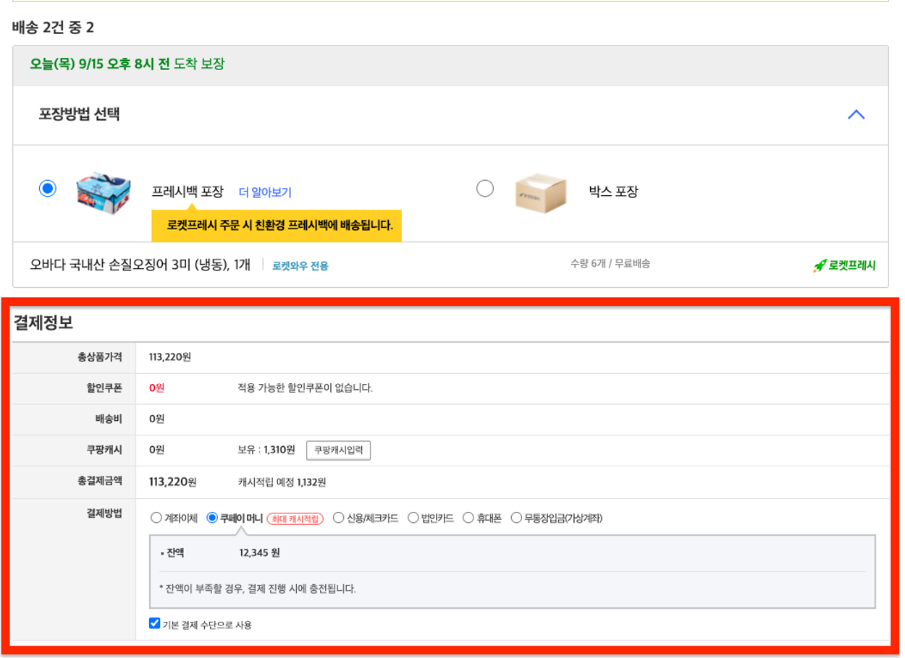

## NUMBLE - 가장 실무에 가까운 쿠팡 클론코딩 5회차

[배포 URL](https://coupang-clone-stage5.netlify.app/cart)

<details>
  <summary style='font-size:20px'>과제보기</summary>

  <div markdown="1">

  <br/>

- 이번 챌린지에서는 [쿠팡 장바구니 페이지](https://cart.coupang.com/cartView.pang)를 구현해보겠습니다

- (링크 주소: [https://cart.coupang.com/cartView.pang](https://cart.coupang.com/cartView.pang))

- [챌린지 페이지](https://www.numble.it/84b74183-c72e-4502-91c9-e41fbf0aa7aa)

## API 목록

1. 카트 조회

   - 경로: /api/cart

   - 보유한 cart-item 목록을 반환합니다.

   - HTTP METHOD: GET

   - Bearer Token 필요

2. 카트 초기화

   - 경로: /api/cart/reset

   - 보유한 cart-item을 모두 삭제하고, 임의로 5개를 생성합니다. (개발 편의를 위해 제공됩니다)

   - HTTP METHOD: POST

   - Bearer Token 필요

3. 카트아이템 업데이트

   - 수량 변경 시 이 API를 사용해주시면 됩니다.

   - 경로: /api/cart-items/[cartItemId]

   - HTTP METHOD: PATCH

   - Bearer Token 필요

   - Request body (example)
     ```json
     {
       "quantity": 3
     }
     ```

4. 카트아이템 삭제

   입력된 ID의 카트아이템을 삭제합니다.

   - 경로: /api/cart-items/[cartItemId]

   - HTTP METHOD: DELETE

   - Bearer Token 필요

---

## 구현


- 이번 챌린지에서는 위 스크린샷에서 붉게 표시된 영역을 구현해볼거에요.

- ‘품절/판매종료상품 전체삭제', ‘묶음배송 추가' 기능은 무시해주세요

<br/>


- 수량 변경 UI는 쿠팡의 selector대신 위 스크린샷처럼 구현해주세요

<br/>

- 아래는 다양한 상황에서의 UI 예시입니다.

- 로켓배송 무료배송 기준이 충족되지 않은 상황 예시입니다.

  

- 장바구니가 비어있는 상황 예시입니다.

  

- 아래 주의사항을 참고하며 구현해보아요.

  - 로켓배송의 무료배송 기준금액은 19,800원이에요

  - 모든 로켓배송 상품은 함께 배송된다고 생각해주세요

  - 모든 판매자배송 상품은 따로 배송된다고 생각해주세요

  </div>

</details>

---

<br/>

- 주요 기능은 삭제와 업데이트 입니다.

- 이 때 아이템을 체크한 다음 삭제 또는 업데이트를 하는 경우가 있는데 이후에도 체크가 유지되어야 했기 때문에 useCartItems라는 custom hook을 만들어서 아이템들의 상태를 관리했습니다.

- 체크가 될 때 마다 `useQueryClient` hook의 `setQueryData`를 사용해서 변경된 데이터를 해당하는 변경해주었습니다

- 그리고 `useEffect`를 통해 데이터가 변경될 때 마다 변경된 UI가 화면에 그려질 수 있도록 했습니다.

```ts
import { useQueryClient } from 'react-query';
import { useState, useEffect } from 'react';
import { ROCKET_ITEM, SELLER_ITEM } from '../constants/cart';
import { cartItemType, checkAddedcartItemType } from '../types/cart';
import { filterItemsByType } from '../utils/cart';

const useCartItems = (data: cartItemType[]) => {
  const [checkAll, setCheckAll] = useState(false);
  const [rocketItems, setRocketItems] = useState<checkAddedcartItemType[]>([]);
  const [sellerItems, setSellerItems] = useState<checkAddedcartItemType[]>([]);
  const [items, setItems] = useState<checkAddedcartItemType[] | undefined>();
  const queryClient = useQueryClient();

  // 전체 체크가 되었는지 확인하는 함수
  const handleCheckAll = (e: React.ChangeEvent<HTMLInputElement>) => {
    const target = e.target as HTMLInputElement;

    if (target.checked) {
      setCheckAll(target.checked);

      const checkAllItems = items?.map((item) =>
        item.checked ? item : { ...item, checked: !item.checked }
      );
      queryClient.setQueryData([`cart-items`], checkAllItems);
      setItems(checkAllItems);
    } else {
      setCheckAll(target.checked);

      const uncheckAllItems = items?.map((item) =>
        !item.checked ? item : { ...item, checked: !item.checked }
      );

      queryClient.setQueryData([`cart-items`], uncheckAllItems);
      setItems(uncheckAllItems);
    }
  };

  // 각각의 아이템을 체크할 때 마다 실행되는 함수
  const handleCheck = (e: React.ChangeEvent<HTMLInputElement>) => {
    const target = e.target as HTMLInputElement;

    const checkedNewItems = items?.map((item) =>
      `${item.id}` === target.id ? { ...item, checked: !item.checked } : item
    );
    queryClient.setQueryData([`cart-items`], checkedNewItems);
    setItems(checkedNewItems);
    setCheckAll(checkedNewItems?.every((item) => item.checked) ? true : false);
  };

  // 수량변경, 체크, 삭제등을 통해 data의 상태가 바뀔 때 마다 실행되어 변경된 UI가 화면에 그려질 수 있도록 했습니다.

  useEffect(() => {
    if (!data) return;

    if (!items) {
      const checkAddedItems = data.map((item) => ({ ...item, checked: false }));
      setItems(checkAddedItems);
      queryClient.setQueryData([`cart-items`], checkAddedItems);
    } else {
      const currentData = queryClient.getQueryData<checkAddedcartItemType[]>([
        `cart-items`,
      ])!;

      const rocketItems = filterItemsByType(currentData, ROCKET_ITEM);
      setRocketItems(rocketItems);
      const sellerItems = filterItemsByType(currentData, SELLER_ITEM);
      setSellerItems(sellerItems);

      setItems(currentData);

      if (currentData.length === 0) {
        setCheckAll(false);
      }
    }
  }, [data]);

  return {
    rocketItems,
    sellerItems,
    handleCheckAll,
    handleCheck,
    checkAll,
  };
};

export default useCartItems;
```

<br/>

- 삭제 쿼리 같은 경우는 아래처럼 성공한 경우에 이전데이터를 불러와서 삭제한 데이터를 제외한 나머지 데이터를 새롭게 반환해주었습니다.

```ts
export const useDeleteCartItem = (cartItemId: number) => {
  const queryClient = useQueryClient();

  return useMutate(() => CartService.deleteCartItem(cartItemId), {
    onSuccess: () => {
      queryClient.setQueryData(
        [`cart-items`],
        (
          prevData: checkAddedcartItemType[] | undefined
        ): checkAddedcartItemType[] => {
          if (!prevData) return [];
          const newItems = prevData?.filter((item) => item.id != cartItemId);

          return newItems;
        }
      );
    },
    onError: () =>
      alert('선택한 상품을 삭제하는데 실패했습니다. 다시 시도해주세요.'),
  });
};
```

- 수량을 업데이트하는 경우에는 `onMutate`를 통해 우선 변경된 수량이 UI에 적용되도록 했습니다.

- 그리고 변경되기 이전의 데이터를 반환해서 에러가 일어나는 경우, `onError`에서 해당 데이터를 받아서 이전 데이터를 UI에 그려주도록 처리했습니다.

```ts
export const useUpdateCartItem = (cartItemId: number) => {
  const queryClient = useQueryClient();

  return useMutate(
    (quantity: number) => CartService.updateCartItem(cartItemId, quantity),

    {
      onMutate: async (quantity: number) => {
        await queryClient.cancelQueries({ queryKey: [`cart-items`] });

        const previousData = queryClient.getQueryData([`cart-items`]);

        queryClient.setQueryData(
          [`cart-items`],
          (
            prevData: checkAddedcartItemType[] | undefined
          ): checkAddedcartItemType[] => {
            if (!prevData) return [];
            const newItems = prevData.map((item) =>
              item.id === cartItemId ? { ...item, quantity } : item
            );
            return newItems;
          }
        );

        return { previousData };
      },

      onError: (_err, _newTodo, context: any) => {
        queryClient.setQueryData([`cart-items`], context.previousData);

        return alert(
          '선택한 상품의 수량을 변경하는데 실패했습니다. 다시 시도해주세요.'
        );
      },
    }
  );
};
```
